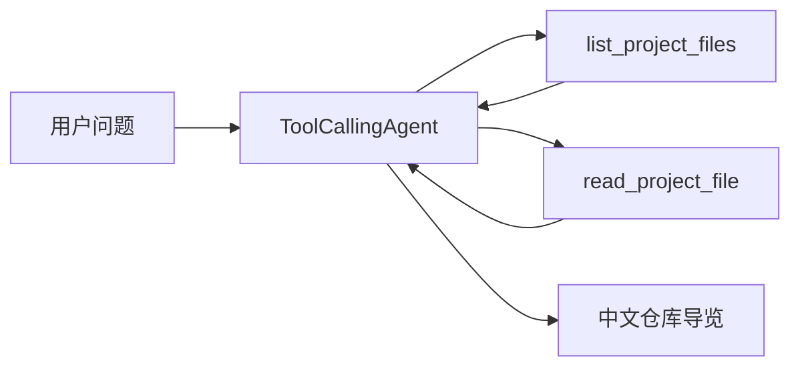

# Repo Guide Agent

一个基于 Hugging Face `smolagents` 的安全仓库导览 Agent，帮助初学者理解陌生代码仓库。

它不会执行模型生成的 Python 或 Shell 命令。Agent 只能调用两个受限的只读工具，列出少量项目文件并读取必要的文本内容，然后用中文说明项目用途、技术栈、可能的入口文件和推荐阅读顺序。

## 功能

- 使用 `ToolCallingAgent` 组织模型与工具调用。
- 输出项目用途、主要技术栈和可能的入口文件。
- 给出面向初学者的文件阅读顺序和下一步建议。
- 在结论中列出实际读取过的相对文件路径。
- 默认最多列出 4 层目录、120 个文件。
- 单个文件最多读取 256 KB，返回模型的文本最多 6000 字符。

## 工作流程



仓库根目录在创建工具时固定，模型无法在调用工具时更换目标仓库。

## 安全边界

项目会拒绝：

- 绝对路径和 `../` 仓库外路径。
- 指向仓库外部的符号链接。
- `.git`、`.venv`、`node_modules`、缓存和构建目录。
- `.env`、`.env.local`、凭证文件和常见私钥格式。
- 不在文本白名单中的文件、二进制内容和超大文件。

`.env.example` 只包含占位符，因此允许列出和读取；真实 `.env` 始终被拒绝。

## 环境要求

- Python 3.10 或更高版本。
- Hugging Face 账号和具备推理权限的只读 Token。

创建并激活虚拟环境：

```powershell
python -m venv .venv
.\.venv\Scripts\Activate.ps1
python -m pip install -r requirements.txt
```

在当前 PowerShell 会话中安全设置 Token，不要把 Token 写进项目文件：

```powershell
$env:HF_TOKEN = (Get-Clipboard -Raw).Trim()
Set-Clipboard -Value "HF Token 已写入当前 PowerShell 会话"
```

在本机终端中，通过 `Read-Host -AsSecureString` 粘贴 Token 时实际只读取到 1 个字符，原因尚未确定。因此这里改为由 PowerShell 直接读取剪贴板，再立即覆盖剪贴板内容。

关闭终端后，该环境变量会自动消失。

## 使用方法

```powershell
python app.py --repo "D:\path\to\repository" --question "这个项目做什么？我应该先读哪些文件？"
```

可选参数：

```text
--max-steps  Agent 最大步骤数，允许 1 到 20，默认 8
```

当前显式使用 `openai/gpt-oss-120b`，并通过 Hugging Face 路由到 Groq 提供商。模型采用 `tool_choice="auto"`，可以按需调用仓库工具，并在信息足够后提交最终答案。云端模型和提供商的可用性可能变化。

## 测试

运行全部离线测试：

```powershell
python -m unittest discover -s tests -v
```

当前测试覆盖路径验证、仓库外逃逸、敏感文件、二进制内容、文件大小、文本截断、工具包装、Token 缺失和错误信息脱敏。

Windows 普通用户默认可能没有创建符号链接的权限；对应测试会明确标记为 `skipped`，其他测试仍须通过。

## 项目结构

```text
repo-guide-agent/
├── app.py
├── repo_guide/
│   ├── agent.py
│   └── repository.py
├── tests/
├── .env.example
├── .gitignore
└── requirements.txt
```

## 上游项目与原创范围

本项目依赖 Hugging Face 的 [`smolagents`](https://github.com/huggingface/smolagents)（Apache-2.0），不复制其框架源码。

- 上游框架提供：`ToolCallingAgent`、`InferenceClientModel` 和 `@tool` 接口。
- 本仓库实现：命令行入口、仓库路径限制、敏感文件过滤、受限文件列表与读取工具、中文导览指令和离线测试。

本项目在 AI 辅助指导下完成。仓库作者完成了项目选择、环境配置、命令执行、功能判断、代码理解、测试验证和 README 调整；AI 提供了代码生成与排错协助。

## 已知限制

- 当前只读取 UTF-8 文本。
- 仅根据有限文件生成导览，不保证理解大型仓库的全部实现。
- 模型输出仍可能出现工具调用格式错误；框架会在最大步骤数以内尝试恢复。
- 本工具只能降低误读和越界风险，不能替代人工代码审查或专业安全审计。
