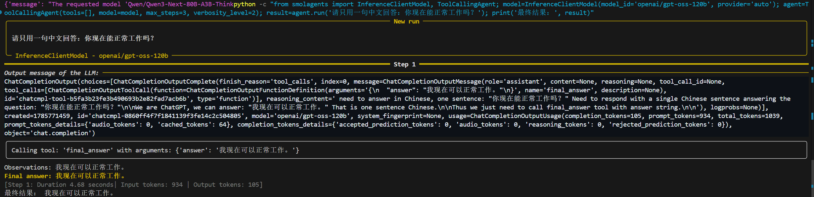
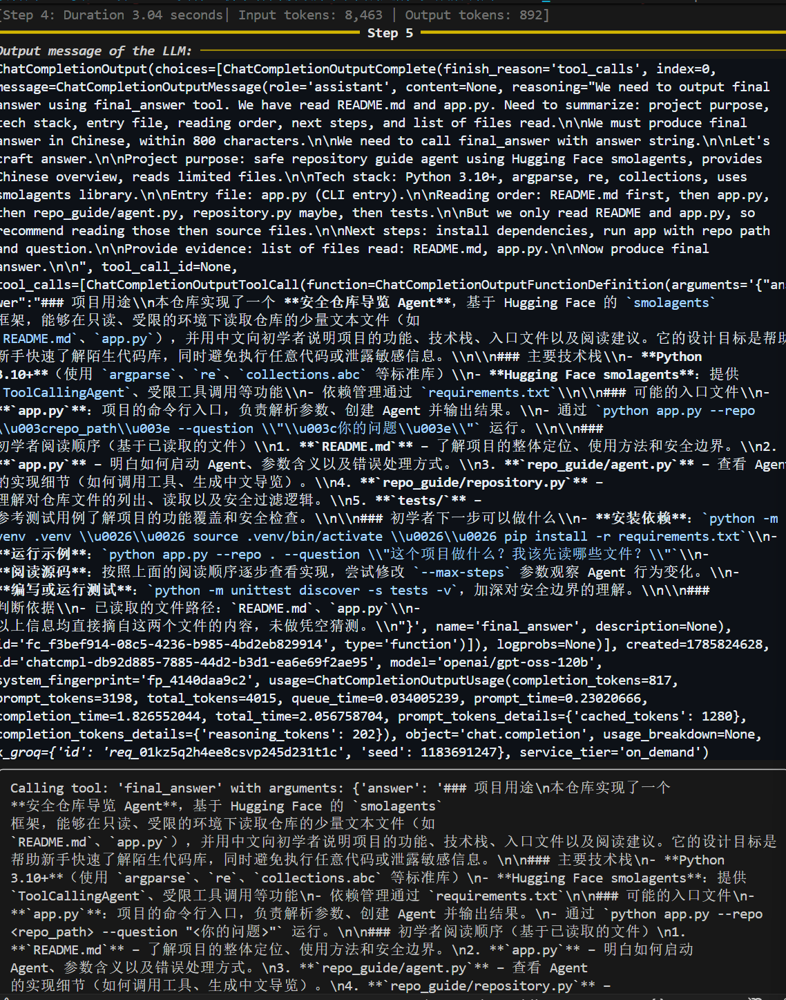
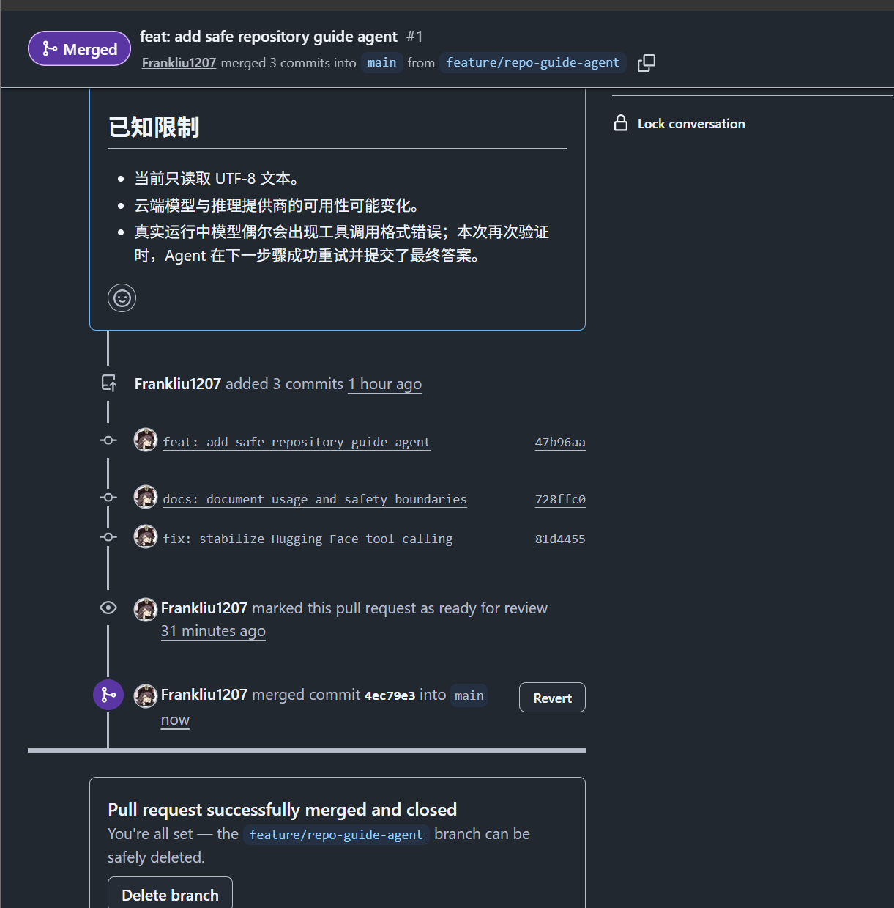

# 开源项目实战：用 AI Agent 探索 smolagents

## 1. 项目信息

- **上游项目：** Hugging Face `smolagents`
- **上游链接：** <https://github.com/huggingface/smolagents>
- **个人实践项目：** Repo Guide Agent
- **个人仓库：** <https://github.com/Frankliu1207/repo-guide-agent>
- **选择原因：** `smolagents` 是 Hugging Face 官方维护且仍然活跃的 Agent 框架，难度适中，既能学习真实 Agent Loop，也适合在其基础上完成一个自己的小应用。

我没有复制或修改整个上游框架，而是阅读其 README、核心 Agent 类和官方示例，并基于 `ToolCallingAgent` 制作了一个安全、只读的仓库导览 Agent。它能够调用受限工具列出仓库文件、读取少量文本，再用中文说明项目用途、技术栈、入口文件和初学者阅读顺序。

## 2. 运行与改动截图

### 2.1 Hugging Face 模型最小真实调用

成功调用 `openai/gpt-oss-120b`，并通过 `final_answer` 返回中文结果。

### 2.2 个人 Repo Guide Agent 真实运行

在 Agent 辅助下增加了“初学者阅读顺序”和安全文件过滤。真实运行时，Agent 根据实际读取的 `README.md` 和 `app.py` 生成中文仓库导览，并调用 `final_answer` 提交结果。

### 2.3 GitHub 分支与 PR

功能在 `feature/repo-guide-agent` 分支开发，经过检查后通过 PR 合入 `main`，保留了功能、文档和模型调用修正三个提交。

## 3. Agent 对话精华

### 3.1 理解 Agent Loop

- **我问了什么：** `InferenceClientModel`、工具和 `agent.run()` 分别负责什么？
- **Agent 帮了什么：** 把流程整理为“用户问题 → 模型选择工具 → 框架执行工具 → 结果作为 Observation 返回 → 模型继续判断 → 最终回答”。
- **我的评价：** 这个解释很有用，让我不再把模型、工具和 Agent 当成同一个东西。

### 3.2 理解为什么要使用受限工具

- **我问了什么：** 为什么模型不能直接读取本地仓库，而必须通过我们编写的工具？
- **Agent 帮了什么：** 解释模型本身没有本地文件权限，工具相当于受控的“手脚”，可以限制路径、文件类型、文件大小和可执行操作。
- **我的评价：** 这让我理解了安全边界，也能解释为什么项目只开放两个只读工具。

### 3.3 排查 HF Token 问题

- **我问了什么：** 为什么身份验证出现 400、401，以及为什么粘贴后环境变量长度只有 1？
- **Agent 帮了什么：** 帮我区分请求格式、无效 Token 和粘贴方式问题，并指导我把 Token 仅写入当前 PowerShell 会话，避免进入代码、截图和 Git。
- **我的评价：** 安全设置方法很有用，但排查过程经过了多次尝试，花费的时间比预计更多。

### 3.4 排查模型与工具调用格式

- **我问了什么：** 默认模型为什么不可用，以及为什么真实运行到第四步会标红？
- **Agent 帮了什么：** 根据报错明确指定可用模型和推理提供商，随后调整 `tool_choice`；最终 Agent 能在格式错误后自行重试并提交答案。
- **我的评价：** 报错定位有帮助，但 Agent 最初给出的提供商方案并没有一次解决问题，仍然需要真实运行验证。

### 3.5 学习 GitHub 工作流

- **我问了什么：** 为什么推送后 GitHub 首页没有显示新文件？
- **Agent 帮了什么：** 解释功能分支与 `main` 的区别，并带我完成检查差异、提交、推送、创建 PR、转为 Ready for review 和合并。
- **我的评价：** 这部分很实用，我第一次完整走完了 GitHub 分支和 PR 流程。与此同时，一开始 Agent 直接完成了过多内容，没有理解我希望分步学习的要求；清理后重新开始才符合我的需求。

## 4. 感想（约 300 字）

这次作业最大的收获，不仅仅只是成功运行了一个 AI Agent 项目，还是第一次完整经历了选择开源项目、阅读 README、配置环境、调用模型、测试功能以及使用 GitHub 分支和 PR 的过程。我逐渐理解了 Agent 的基本工作方式：模型负责理解问题和决定下一步，像人类的大脑，真正执行列出文件、读取内容等操作的则是工具，他们就像受限制的“手脚”；通过限制路径、文件类型和读取长度，我也认识到 Agent 安全边界的重要性。

Agent 在解释陌生代码、定位 Token 和模型提供商问题、生成代码及补充测试方面很有帮助，但它不总是可靠的，有时会直接做得过多，没有很好的理解我的意思，也会出现工具调用格式错误。所以，使用 Agent 时仍然需要自己检查输出、判断修改是否合理并验证最终结果。

## 5. 完成说明

本项目在 AI 辅助指导下完成。AI 提供了代码生成、知识解释和排错帮助；我本人完成了项目选择、账号与环境配置、命令执行、功能判断、代码理解、测试验证、README 调整以及 GitHub 分支和 PR 操作。
